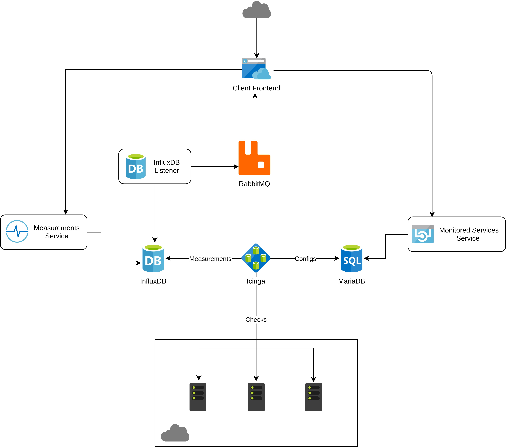

# Statuswebsite
Eine öffentliche (aber nur sehr einfache) Statusseite für Webseiten angelehnt an [Statuspage.io](https://www.atlassian.com/software/statuspage), welche als Projekt im Rahmen der Vorlesung "Verteilte Systeme" angefertigt wurde. Aus diesem Grund setzt das Projekt auf eine Mikroservice Struktur, die über ein Kubernetes Cluster gehostet wurde.

Dieses Repository enthält sowohl die Dokumentation, als auch den Code des Projektes. Die anderen Teile des Projektes (wie z.B. die Vagrant VM und das Ansible Skript) sind auf dem GitLab Server der Universität Paderborn zu finden:

* [Ansible Skripts](https://git.cs.uni-paderborn.de/fejp/ansible) (Archiviert, öffentlich zugänglich)
* [Vagrant VM](https://git.cs.uni-paderborn.de/fejp/vagrant-box) (Archiviert, öffentlich zugänglich)
* [Angepasster Icinga 2 Docker Container](https://git.cs.uni-paderborn.de/fejp/icinga2-docker) (Archiviert, öffentlich zugänglich)

# Autoren
* [Ella Vahle](https://github.com/EllaMV)
* [Florian Bürger](https://github.com/Boerger22)
* [Jakob Greuel](https://github.com/Orinion)
* [Pascal Wiedenbeck](https://github.com/wbpascal)

# Entwicklung
Für die Entwicklung wird eine Vagrant VM eingesetzt, auf der ein Kubernetes Cluster mit allen benötigten Diensten gehostet wird. Diese VM wird mithilfe des gleichen Ansible-Skripts aufgesetzt, wie auch die Produktionsumgebung, weshalb die VM zum größten Teil identisch zu Produktionsumgebung ist. Alle Informationen, wie mithilfe der Vagrant-VM entwickelt werden kann sind in der [DEVELOPMENT.md](./DEVELOPMENT.md) Datei zu finden.

# API Spezifikationen
Folgende API Spezifikationen sind über Swagger Hub zu erreichen:

* [Authentication API](https://app.swaggerhub.com/apis-docs/wpascal/Authentication/1.0.0)
* [Measurements API](https://app.swaggerhub.com/apis-docs/wpascal/Measurements/1.0.0)
* [Monitored Services API](https://app.swaggerhub.com/apis-docs/vs-status/Monitored-Services/1.0.0)
* [Token API](https://app.swaggerhub.com/apis-docs/wpascal/Token/1.0.0)

# Architektur
Als Grundstein der Architektur wird `Icinga` verwendet, welches den Status beliebiger Webseiten oder Dienste ausließt und die Messdaten in `InfluxDB` ablegt. Die Microservices lesen diesen Status von `InfluxDB` aus und stellen ihn in einem für den Benutzer lesbares Format dar. Echtzeitinformationen werden über `RabbitMQ` von einem `InfluxDB Listener` an das Frontend weitergegeben, welcher wiederrum diese Updates über Websockets an den Client weitergibt.

Ursprünglich war noch eine Admin-Oberfläche geplant, welche einen vereinfachten Zugrif auf das Management von Icinga bieten sollte. Dieses wurde jedoch aus Zeitgründen nicht umgesetzt. Einige Services, welche für diese Oberfläche nötig gewesen wären, sind jedoch bereits implementiert worden, wie z.B. der `Token Service` oder der `Authentication Service`.

Eine genauere Übersicht, wie die einzelnen Dienste miteinander kommunizieren, kann im folgenden Bild betrachtet werden.

